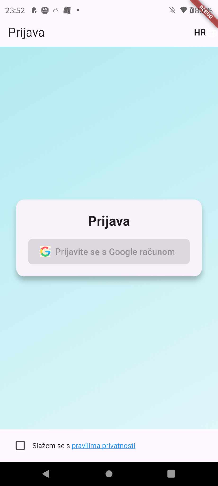
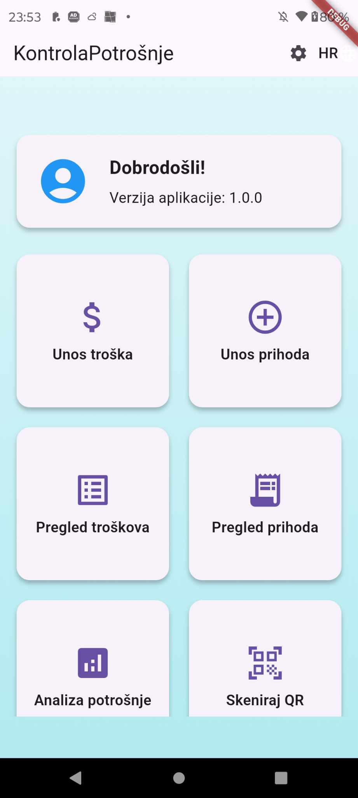

# 📊 KontrolaPotrošnje

**KontrolaPotrošnje** je mobilna aplikacija za praćenje osobnih financija, razvijena pomoću Fluttera i Firebasea.

---

## 🔧 Funkcionalnosti

- ✅ Dodavanje prihoda i troškova
- ✅ Prikaz ukupne potrošnje
- ✅ Spremanje podataka u Firebase Cloud Firestore
- ✅ Google prijava (Sign-In)
- ✅ Sučelje na hrvatskom jeziku 🇭🇷

---

## ▶️ Kako pokrenuti aplikaciju

1. **Kloniraj repozitorij**

```bash
git clone https://github.com/JJ-257/KontrolaPotrosnje.git
```

2. **Instaliraj sve pakete**

```bash
flutter pub get
```

3. **Dodaj Firebase konfiguraciju** (nije uključena u repozitorij):

- Android: `android/app/google-services.json`

📌 Te datoteke preuzmi iz svog Firebase projekta. Bez njih aplikacija se neće moći povezati s bazom podataka.

4. **Pokreni aplikaciju na emulatoru ili fizičkom uređaju**

```bash
flutter run
```

---

## 🛠️ Tehnologije korištene

- **Flutter** – za razvoj korisničkog sučelja
- **Firebase Auth** – za autentifikaciju korisnika
- **Cloud Firestore** – za pohranu podataka u oblaku
- **Google Sign-In** – za Google prijavu

---

## 📦 APK datoteka 


👉 [Preuzmi APK ovdje](https://github.com/JJ-257/KontrolaPotrosnje/releases/tag/v1.0.0)

---

## 📸 Izgled aplikacije

### 🧾 Prijava


### 📊 Glavni ekran

## 👨‍💻 Autor

Razvio: [JJ-257]  
Godina: 2025
=======
# KontrolaPotrosnje

